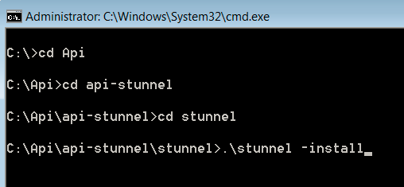

# Configuration de l&#39;API de requête{#query-api-setup}

Guide rapide de configuration d’une API de requête.

Pour configurer l’API de requête, procédez comme suit :

1. Acquisition du certificat d&#39;API de requête

   Envoyez un courrier électronique à l’équipe des opérations techniques d’Adobe Email - `Dataworkbench@adobe.com`.

   Indiquez le nom CN que vous souhaitez utiliser pour l&#39;API de requête (attribuez un nom générique tel que `<Client>` Query API).

   >[!NOTE]
   >
   >Les opérations techniques généreront le certificat et le téléchargeront dans une URL. Veuillez informer les consultants Adobe après avoir reçu la notification de Tech Ops concernant la génération réussie du ticket afin qu’ils vous le renvoient.

1. Téléchargement et extraction de l’entonnoir d’API. Recevez le fichier api-stunnel de votre consultant.

   Assurez-vous que Perl est installé sur votre machine.

   Dans le dossier extrait (chemin d’accès au dossier dans lequel vous copiez le fichier), copiez le certificat de l’API de requête dans le dossier *stunnel* .

1. Configuration du fichier Stunnel.conf

   Il doit y avoir un fichier appelé *stunnel.conf* dans le dossier *Stunnel* (où vous avez copié votre certificat).

   Modifiez le fichier dans le Bloc-notes.

   

   Modifiez les paramètres comme suit : 

   Deux paramètres doivent être modifiés dans ce fichier.

   * *Cert* = nom figurant sur votre certificat. Dans cet exemple, il s’agit de Aadhithiya Ramani QAPI Client.pem.
   * *Connect* = nom du serveur pour votre DPU principal.

1. Copie du fichier *Query.pm*.

   Le fichier *Query.pm* sera disponible dans le dossier API Insight.

   Copiez le fichier *Query.pm* et collez-le dans votre dossier de bibliothèque Perl (il s&#39;agit généralement de *C:\Perl64\lib *, mais vérifiez l&#39;emplacement d&#39;installation de Perl sur votre ordinateur).

1. Modification du fichier *api-http.pl*

   Le fichier api-http.pl sera disponible dans le dossier api-stunnel.

   Un seul paramètre à modifier

   *My $profile* = nom du profil pour lequel vous configurez l’API de requête.

1. Installez l’API de requête.

   Ouvrez l’invite de commande dans votre système en tant qu’&quot;Administrateur&quot; et accédez au répertoire dans lequel vous avez extrait le *canal* , comme illustré ci-dessous : 

   Run the following command *.\stunnel -install*. 

   Une fois la commande exécutée, une fenêtre s’ouvre et indique que le *canal* est installé.

   >[!NOTE]
   >
   >Une fois la commande exécutée, une fenêtre s’ouvre et indique que le *canal* est installé.

1. Test de la configuration du canal d&#39;entonnoir de l&#39;API de requête

   L’étape finale de ce processus sera de tester la configuration de l’API de requête. Dans l&#39;invite de commande que vous avez utilisée pour installer le répertoire api-stunnel. 

   Exécutez le script Perl disponible dans ce dossier à l’aide de la commande suivante* perl api-http.pl*. 

   Après avoir exécuté le script, les résultats doivent être semblables à la capture d’écran ci-dessous (la date, l’heure et les valeurs du résultat varient selon l’heure et les autres paramètres du profil sur lequel vous avez configuré l’API de requête (étape 6). 

