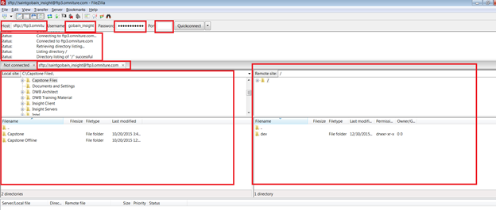

# Validation des serveurs FTP internes et externes{#validation-of-internal-and-external-ftp-servers}

Ce guide rapide décrit les étapes minimales requises pour valider la configuration FTP interne et externe.

Un FTP interne est utilisé lorsqu’un consultant/architecte interne à Adobe doit se connecter au site FTP pour le téléchargement ou le transfert de fichiers, tandis qu’un FTP externe est principalement destiné à vous, en tant qu’utilisateur, pour le transfert des fichiers de données requis.

Pour plus d’informations sur la configuration des serveurs FTP, voir [Protocole de transfert de fichier](https://experienceleague.adobe.com/docs/analytics/export/ftp-and-sftp/ftp-overview.html?lang=fr).

## Étapes de validation - FTP externe {#section-24428111b5c542ce81a765cd63424b97}

1. Ouvrez une invite de commande. (Windows+R et type cmd)
1. Saisissez ftp `<ftp server>`
1. Indiquez le nom d’utilisateur et le mot de passe. 

1. Modifiez le répertoire local à partir duquel un fichier peut être déplacé. Utilisez la commande suivante :

[!DNL ftp> lcd C:\Users\andixit\Desktop]

répertoire local maintenant [!DNL C:\Users\andixit\Desktop].

1. Copiez le fichier de l’emplacement local vers l’emplacement distant. 

1. Déconnectez-vous du serveur distant. (Utiliser sous la commande )

[!DNL ftp> bye]

[!DNL 221 Goodbye]

>[!NOTE]
>
>Une autre méthode de validation du FTP consiste à utiliser Filezilla. Indiquez le nom d’hôte, le nom d’utilisateur, le mot de passe et le port. Le côté droit du panneau est le site distant et le côté gauche est le site local. Pour valider le protocole FTP, effectuez un glisser-déposer de fichiers du site local vers le site distant et vers la version v.v.

## Étapes de validation - FTP interne {#section-b1f7a789ad6848cf9027f7953d81066e}

Les étapes ci-dessus peuvent être suivies pour valider le ftp interne à partir de n’importe quel serveur Adobe.
