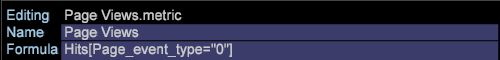

# Modifications de configuration pour le nouveau schéma{#configuration-changes-for-new-schema}

{{eol}}

Ce document explique comment modifier toutes les configurations de Data Workbench par défaut une fois le nouveau schéma en place.

## Présentation du schéma du jeu de données {#section-2ffac5170c894781bc943565af7ad479}

La base du schéma du jeu de données se compose d’un ensemble clé de relations qui forment la colonne vertébrale du schéma d’analyse web du Data Workbench. Dans l’exemple suivant, un schéma d’analyse web classique fournit une idée des relations entre un visiteur, une visite et une page vue. 

* Un visiteur donné peut avoir une ou plusieurs visites.
* Une visite donnée est générée par un seul visiteur.
* Toute visite donnée peut inclure une ou plusieurs pages vues.
* Une page vue donnée n’appartient qu’à une seule visite. `<discoiqbr>`

Avec l’évolution du Web et du monde des affaires, les besoins de l’analyse des données et du Web ont changé. Les sites Web ont commencé comme des endroits où regarder le contenu. Vous pouvez désormais consulter le contenu ; correspondent de manière interactive par le biais de tchats, de vidéos ou d’envois ; acheter des produits; et bien plus encore. En outre, les entreprises souhaitent désormais intégrer leurs données web à d’autres canaux de données dans leur entreprise afin d’obtenir une meilleure vue d’ensemble de leurs activités. Par exemple, une entreprise peut souhaiter intégrer son site web, son centre d’appels, son adresse électronique, ses réseaux sociaux, et stocker et stocker les données sur ses clients. Avec cette intégration de canaux hors ligne et en ligne, les schémas des jeux de données ont évolué au fil des années, où deux schémas de jeux de données ne sont pas identiques.

`<discoiqbr>`Lorsque vous intégrez les données en ligne et hors ligne, le terme &quot;visiteur&quot; ne semble pas toujours approprié. Par conséquent, le terme &quot;client&quot; est parfois utilisé à la place du visiteur.  

Le niveau &quot;Engagement&quot; est utilisé pour activer une vue unique du temps, lorsque vous disposez de données provenant de plusieurs sources de données. Supposons, par exemple, que vous n’ayez qu’une seule source de données : données de commerce électronique collectées par l’activité des visiteurs sur votre site web. Dans ce cas, le niveau Visite indique les visites de ces visiteurs sur votre site. Notez que les dimensions temporelles - &quot;Jour&quot;, &quot;Semaine&quot;, &quot;Mois&quot;, etc. - sont généralement capturés au niveau &quot;Visite&quot;.

De même, le niveau &quot;Événement&quot; rassemble tous les événements (page vue, appel effectué au centre d’appel, etc.) qui se sont produits au cours d’un engagement. Il combine tous les événements en ligne et hors ligne pour un client au cours d’un engagement.

## Nouvelle structure dénombrable dans DWB {#section-b77638ec04e4441cb51c56fd3d4abeb6}

La nouvelle structure de schéma remplace Visiteur par client, Visite par engagement et Accès par événement. 

## Modifications de configuration conformément au nouveau schéma de jeu de données {#section-27135515be5c471ba2ee879d1ef4771f}

Pour modifier le schéma du jeu de données du visiteur au client, vous devez modifier les fichiers de configuration suivants :

1. Tous les fichiers de configuration situés sous le dossier Jeu de données où des dimensions dénombrables et étendues sont définies. 

1. Fichiers de configuration sous le dossier Dimension, où &quot;visiteur&quot;, &quot;visite&quot; ou &quot;événement&quot; sont utilisés comme niveau.

   Exemple : Fichier Campaign.cfg. Dans le profil SC Adobe, Campaign est défini au niveau de la visite. 

   L’exemple suivant donne une idée du changement du schéma parent de Visite à Engagement : 

1. Comme certaines mesures sont dérivées ou créées à partir de tableaux dénombrables, les fichiers de configuration situés sous le dossier Mesures doivent être modifiés ou créés.

   Par exemple : création d’une mesure [!DNL Customers.metric with formula = sum(one,customer)] ou comme Pages vues.metric à *define* au niveau de l’accès. Modifiez la mesure, puis modifiez le niveau en Événement au lieu d’Accès.

   Adobe de la mesure Pages vues SC définie au niveau Accès : 

   `<discoiqbr>` `<discoiqbr>`Voici la mesure Pages vues conformément au nouveau schéma : 

1. Modifiez la variable *order.txt* dans le dossier des mesures afin qu’il reflète les mesures nouvelles ou modifiées liées au client, à l’engagement et à l’événement.

   Adobe *SC order.txt* fichier . 

   *Order.txt* avec de nouvelles modifications de schéma : 

1. Tous les fichiers de configuration (.vw) situés sous le dossier Visualisation doivent être modifiés pour faire référence aux nouveaux niveaux : Client, engagement et événement. Par exemple : Carte des processus 2D, Carte des processus 3D, etc.

   Adobe SC default URI.vw pour la carte des processus 2D est défini au niveau de l’accès et au groupe de visites comme illustré ci-dessous : 

   Modifications à effectuer dans URI.vw pour le nouveau schéma : 
