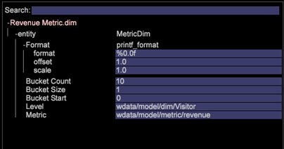

# Configuration des dimensions dérivées{#derived-dimensions-setup}

Les différents types de dimensions dérivées (côté client) et comment les configurer dans les Outils de données.

## Types de dimensions dérivées {#section-33e6dcc9ab9745de9b830cecb2427ca3}

**Dimensions des mesures**

La dimension de mesure vous permet de regrouper les décomptes de mesures selon un niveau spécifique. Il vous permet également de grouper les comptes de mesures selon un niveau spécifique. Une fois qu’une dimension de mesure est créée, vous pouvez segmenter les données en fonction de la valeur de la mesure.

Exemple 1 : Vous êtes une société de voyage et vous voulez comprendre la différence des activités comportementales sur le site Web entre vos voyageurs fréquents et les clients qui ont réservé un vol moins de 5 fois. Comment feriez-vous cela ?

Tout ce que vous avez, c&#39;est le décompte des réservations comme mesure, comment segmenterez-vous les clients en fonction d&#39;une mesure -ici, réservation -pour comprendre leur comportement sur le site Web ?

Exemple 2 : Vous êtes une banque financière et vous souhaitez regrouper vos clients en fonction du nombre de CD dans lesquels ils ont investi. Vous souhaitez segmenter vos clients en 3 niveaux. Niveau 1 -Clients avec plus de 10 CD, Niveau 2 -Clients avec plus de 5 et moins de 10 CD et Niveau 3 -Clients avec plus de 0 et moins de 5 CD

Les informations dont vous disposez sont des mesures qui vous donnent le nombre d&#39;investissements dans les CD. Comment allez-vous créer des segments de clients fatigués pour votre analyse ?

*Création d&#39;une dimension de mesure - via Workstation*

Marquez l’une des dimensions de mesure OOB comme locale et renommez cette dimension avec un nom personnalisé / Faites une copie locale du fichier RenameDim.example et renommez-la en nom de dimension approprié avec l’extension .dim.

Ouvrez la nouvelle dimension dans le poste de travail pour apporter des modifications. Modifiez les paramètres suivants de la dimension de mesure en fonction des besoins : 

Mesure - Mesure à regrouper

Niveau - Niveau auquel les mesures seront regroupées

Début du compartiment - Élément de départ de la dimension de mesure. Entrez la même valeur en décalage.

Taille de l&#39;intervalle - Taille de regroupement de la mesure. Entrez la même valeur dans l&#39;échelle

Nombre d&#39;intervalles - Nombre maximal d&#39;éléments à afficher dans la dimension

Enregistrez la nouvelle dimension sur le serveur si vous souhaitez la partager avec d’autres personnes.

**Dimensions du préfixe**

L’objectif principal de la dimension Préfixe est de regrouper les éléments de la dimension d’origine et de fournir des noms conviviaux aux aux éléments regroupés.

Par exemple, vous possédez un site de vente au détail et votre site comporte diverses sections telles que Vêtements pour femmes, Vêtements pour hommes, Jouets et Jeux, Décor, etc. Chaque section du site comporte plusieurs pages associées. Vous souhaitez analyser les chemins et obtenir des informations sur le trafic qui va d&#39;une section du site à une autre, etc. Si vous utilisez la dimension URI, vous devrez extraire chaque page de chaque section du site dans le Navigateur de chemins ou dans Process Map et poursuivre l’analyse.

La même analyse peut être effectuée facilement s’il existe une dimension Préfixe dont les pages d’une section de site sont regroupées en un seul élément.

Création d’une dimension de préfixe :

Ouvrez un mappage de processus 2D à partir du menu Visualisation.

Modifiez les paramètres suivants de la dimension de préfixe en fonction des exigences.

Modifier la dimension de zone cliquable - Dimension que vous souhaitez utiliser pour la zone de processus 2D (Ex : Typologie SMS)

Modifier la dimension de niveau de zone cliquable - Niveau de la dimension mentionnée ci-dessus

Modifier la dimension de l&#39;élément de zone cliquable : niveau dénombrable auquel vous souhaitez examiner les données.

Modifier la mesure de zone cliquable : mesure à examiner.

Une fois le mappage de processus 2D défini, ouvrez la dimension que vous avez mentionnée dans le paramètre de dimension de mappage des modifications.

Sélectionnez les éléments que vous souhaitez regrouper. Utilisez CTRL+ALT et faites glisser et déposez les éléments pour effectuer le mappage.

Cliquez avec le bouton droit sur le point qui s’affiche et renommez le groupe. Si vous avez sélectionné 3 éléments à regrouper, le nom par défaut sera 3 sélectionnés.

Cliquez avec le bouton droit sur le contour de la visualisation et enregistrez la dimension dans le menu qui s&#39;affiche.

**Renommer les dimensions**

Renommer les dimensions est créé à partir d’une dimension préexistante. L’objectif principal de la dimension Renommer est de fournir des noms conviviaux aux aux éléments de la dimension. La dimension Renommer prête à l’emploi est la dimension Page créée à partir de la dimension URI. La dimension URI peut être confuse pour une personne qui ne connaît pas les noms techniques des pages et c’est pourquoi la dimension Page vous permet de renommer des éléments de la dimension URI.

CRÉATION DE DIMENSIONS DE RENOMMAGE PERSONNALISÉES :

Les éléments de la dimension Renommée contiennent un mappage Un-à-un avec les éléments de la dimension de base d’origine. Vous pouvez le vérifier en ouvrant le fichier .dim de la dimension Renommer dans le bloc de notes/station de travail. Vous remarquerez que chaque élément de la dimension d’origine n’a qu’une seule valeur (Renommer la chaîne) par rapport à lui dans le fichier.

Si vous disposez de moins d’éléments à des fins de changement de nom ; vous pouvez créer un fichier .dim dans le poste de travail et renommer chaque élément individuel en suivant les étapes décrites ci-dessous.

Procédure de création d’un fichier .dim pour une dimension Renommer - Utilisation de la station de travail

Utilisez cette option si le nombre d’éléments à renommer est inférieur.

1. Ouvrez un espace de travail vide et ouvrez le Gestionnaire de dimensions. Cliquez avec le bouton droit de la souris > Admin > Profil > Gestionnaire de profils.
1. Développez le dossier Dimensions dans la colonne Fichier.
1. Développez le dossier Page dans la colonne Fichier et cliquez avec le bouton droit sur le fichier Page.dim de la deuxième colonne vers la dernière (cette colonne représente généralement le nom du profil) et cliquez sur l’option &quot;Rendre local&quot;.
1. Cliquez avec le bouton droit sur Page.dim dans la colonne &quot;Utilisateur&quot; et cliquez sur l&#39;option Copier et collez le fichier .dim copié dans le dossier de votre choix sous le répertoire Dimensions.
1. Cliquez sur OK dans le message d&#39;erreur.
1. Vous remarquerez maintenant qu’il existe deux fichiers Page.dim sous le dossier Dimensions. L&#39;un est le fichier d&#39;origine sous le répertoire Dimensions\Page et l&#39;autre est celui que vous venez de copier collé à l&#39;étape 4.
1. Cliquez avec le bouton droit sur le fichier Page.dim récemment collé sous la colonne Utilisateur et cliquez sur la zone de saisie bleue/grise qui indique Page.dim. La zone d’entrée devient verte lorsque le curseur clignote, ce qui indique qu’elle peut être modifiée. Entrez le nom de la dimension Renommer que vous souhaitez créer.
1. Vous remarquerez que le fichier Page.dim dans la colonne Fichier a été remplacé par le nouveau nom de fichier que vous avez donné à l’étape 7. Cliquez avec le bouton droit sur le fichier new.dim dans la colonne Utilisateur (Dernière colonne) et sélectionnez Ouvrir > Dans Workstation.
1. Une fois le fichier .dim ouvert dans la station de travail ; cliquez sur le signe plus (+) en regard de l&#39;entité et développez-la. Observez la valeur présente par rapport au champ &quot;Parent&quot;, elle reflète la dimension &quot;URI&quot;. Il affiche &quot;wdata/model/dim/URI&quot; Cliquez sur la zone d’entrée bleue/grise pour changer l’URI en nom de la dimension dont vous souhaitez renommer les éléments.
1. Assurez-vous que la dimension que vous souhaitez renommer existe dans le jeu de données. Les noms de dimension sont sensibles à la casse ; conservez donc la casse de la dimension d’origine.
1. Observez la mention &quot;modifié&quot; qui apparaît en regard du nom de la dimension. Cela indique que la dimension d’origine a été modifiée. Maintenir les changements apportés à l&#39;étape 9; Cliquez avec le bouton droit sur new.dim (modifié) et cliquez sur l&#39;option &quot;Enregistrer sous&quot;.
1. Une fois la dimension enregistrée à l’étape 10, la nouvelle dimension Renommer pour les campagnes est désormais disponible dans le but de renommer. Vous n’avez accès qu’à ce service localement.
1. Pour que d’autres puissent voir la dimension que vous avez créée, elle doit être enregistrée sur le profil. Cliquez avec le bouton droit sur le fichier .dim de la nouvelle dimension dans la colonne &quot;Utilisateur&quot; (Dernière colonne) et cliquez sur &quot;Enregistrer dans > Nom du profil&quot; dans laquelle vous souhaitez enregistrer la dimension.
1. Après avoir enregistré le fichier dans le profil, tous les utilisateurs de station de travail qui ont accès à ce profil pourront voir la dimension Renommer pour les campagnes.

Outil Préfixe et Renommer le créateur de l’image dynamique

Adobe dispose d’un outil Excel pour générer des dimensions Préfixe et Renommer.

Vous trouverez ci-dessous la procédure à suivre pour générer les dimensions Préfixe/Renommer à l’aide de l’outil :

1. Enregistrez l’outil Excel *Adobe_DWB_Dimension_Generator.xlsm* dans un dossier. Contactez le service à la clientèle d’Adobe pour télécharger l’outil.
1. Ouvrez l’outil et activez les macros : 

1. Remplissez la feuille de données avec les valeurs à utiliser.

   Par exemple, nous créons la dimension Préfixe de marque de produit en fonction de la dimension Produit. Les informations suivantes sont saisies dans la feuille de données : 

   Chaque produit est affecté à une marque dans la feuille de données.

1. Dans l’onglet Configuration, renseignez les informations relatives à la dimension à créer. Pour les données d’exemple ci-dessus, les informations suivantes sont saisies : 

   Nom : Nom de la dimension Préfixe/Renommer

   Type : Préfixe/Renommer

   Dim source : Dimension d’origine

   Correspondre à la colonne : Colonne à mettre en correspondance

   Colonne de résultats : Valeur à utiliser pour la nouvelle dimension.

1. Cliquez sur le bouton intitulé *Cliquez ici*. 

1. Le fichier dim sera généré dans le dossier où l&#39;outil a été enregistré. 

   A l’aide du Gestionnaire de profils, enregistrez le fichier dim dans le dossier Dimension.

**Dimensions de décalage**

Les dimensions Maj vous permettent de regarder le N° élément de n’importe quelle dimension dans une dimension dénombrable particulière.

Ils vous permettent également de regarder en arrière l’élément -énième de n’importe quelle dimension dans une dimension dénombrable particulière.

Exemple 1:

* Neuvième page dans une session -Dimension Page suivante
* Neuvième page d’un visiteur -Page suivante du visiteur -sur toutes les sessions
* Nth appel d’un utilisateur

Pourquoi est-il important de connaître le énième élément de la dimension dénombrable ?

* Vous souhaitez connaître la 5e page affichée dans une session.
* Vous souhaitez effectuer un cheminement sur les campagnes pour comprendre quelle campagne 2nd a été consultée après avoir affiché la campagne &quot;Compte de contrôle gratuit&quot; ?
* Vous voulez comprendre le lien sur lequel le visiteur a cliqué avant de cliquer sur le lien &quot;Chatter avec un agent&quot; ? 

L’URI suivant est l’une des dimensions OOB Shift qui peut être utilisée comme modèle. L’exemple ci-dessus vous donne l’élément 2nd(Offset = 1) de la campagne (Dim = Campaign) dans l’événement d’engagement (Clip = Engagement Event).

Ici, le décalage 1 signifie qu’il faut regarder vers la droite dans l’événement.

Autres dimensions de décalage OB

*Page suivante:*

Page suivante affichée dans une session après avoir sélectionné Page dans la dimension Page

Le décalage est de 1, le niveau est Page vue, le creux est Page et le clip est Session

*Page précédente:*

Page précédente affichée dans une session avant la page sélectionnée dans la dimension de page

Le décalage est ici de -1, le niveau est Page vue, le creux est Page et le clip est Session

Quelle sera la campagne précédente affichée avant la campagne actuellement sélectionnée par un visiteur ?

Le décalage est ici de -1, le niveau est Réponse de la campagne, le point est la valeur de l’attribut Réponse de la campagne et le point est le visiteur.

*Création de la dimension Maj - Via Workstation*

* Marquer l’une des dimensions de décalage OOB comme locale
* Renommer cette dimension avec un nom personnalisé
* Ouvrir la nouvelle dimension dans le poste de travail pour apporter des modifications
* Modifiez les paramètres suivants de la dimension de mesure en fonction des besoins.

   * Dimension de niveau à compter
   * Décalage-Vous voulez regarder vers l&#39;avant vers l&#39;arrière
   * Dim -Dimension dont vous souhaitez analyser les éléments
   * Clip-Comptable dans que vous souhaitez afficher.

* Enregistrez la nouvelle dimension sur le serveur si vous souhaitez la partager avec d’autres personnes.

**N dernière dimension**

Les N dernières dimensions fonctionnent uniquement sur la dimension Heure et à partir du moment du système. Les dimensions d’heure OB sont Jour, Semaine, Heure et Mois. Vous pouvez créer la dimension N dernier pour chacune de ces dimensions d’heure de base, telles que 10 derniers jours, 72 dernières heures, 8 dernières semaines, 6 derniers mois, etc. N dernière dimension calcule N dernier en fonction de la &quot;mesure Heure du rapport&quot; actuelle ou A partir de l’heure du système. 

Nombre - Nombre total d’éléments à afficher dans la dimension

Décalage de plage - Valeur de décalage indiquant le point de départ (Jour/Semaine) pour calculer les N derniers jours/Semaine.

**None.dim**

None.dim est une dimension d’alias. Il est utilisé pour créer un alias à partir de dimensions étendues.

Exemple :

Dans le fichier None.dim, l’entité est définie comme &quot;wdata/model/dim/Parent/+name&quot; (il peut être modifié), ce qui signifie créer la dimension selon le nom du fichier de dimensions. Ainsi, si nous créons une copie du fichier None.dim sous le dossier Dimension (par exemple, en copiant et renommant le fichier None.dim sous le dossier Profil du visiteur) et en le renommant &quot;Log Source ID.dim&quot;, une nouvelle dimension dérivée avec l’identifiant de source du journal apparaît dans le menu sous Profil du visiteur, comme illustré ci-dessous :

Avant les modifications : 

Après les modifications de None.dim : 

L&#39;entité peut être remplacée par le nom de la dimension étendue, dans ce cas une autre dimension avec un autre nom pointant vers la même dimension, comme illustré ci-dessous :

Dans cet exemple, le fichier &quot;Source Name.dim&quot; contient le contenu suivant : 

Un autre nom de source de dimension pointant vers l&#39;ID de source du journal s&#39;affiche. 

**Masquage des dimensions dérivées**

Pour masquer la dimension dérivée, définissez la propriété *Show* sur &quot;false&quot;. 

