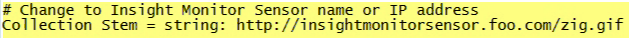
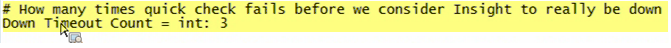

# Installation du profil de surveillance{#installing-the-monitoring-profile}

Instructions d’installation du Profil de surveillance des outils de données.

## Étapes d&#39;installation {#section-d4355dbea8a447f48ab168db6ccff612}

1. Configurez une nouvelle instance Sensor comme si elle était utilisée pour la collecte de données de page Web balisée. Assurez-vous que le fichier zig.gif se trouve à la racine du document du serveur Web Sensor. Le capteur peut être exécuté sur le même hôte que les profils du moniteur. (Ce n’est pas un problème si vous utilisez un fichier texte à cette fin.)

   >[!NOTE]
   >
   >Cette instance de capteur doit être dédiée à la réception du trafic uniquement par les agents de surveillance. En outre, le capteur peut être configuré pour s’exécuter sur un port différent si vous réaffectez un serveur Web à cette collection.

1. Dans le fichier [!DNL txlogd.conf], il existe la ligne par défaut :

   ```
   <b>ContentFilterExclude</b> image/,text/css,application/x-javascript,text/javascript
   ```

   Pour l’application de Profil de surveillance des outils de données (ou toute mise en oeuvre de page &quot;balisée&quot;), le type d’image doit être supprimé pour être collecté via un fichier GIF. La ligne mise à jour est la suivante :

   ```
   <b>ContentFilterExclude </b>text/css,application/x-javascript,text/javascript
   ```

1. Copiez [!DNL insight_monitor.zip/insight_monitor_agent] dans un emplacement temporaire.
1. Mettez à jour le fichier [!DNL insight_monitor_agent.cfg] de votre environnement. Suivez les commentaires contenus dans le fichier de configuration :

   **Le fichier de configuration Monitoring :**

   

   Définissez l’emplacement où vous collectez toutes les informations et indiquez l’adresse URL. Il doit s&#39;agir d&#39;un capteur dédié et ne doit recevoir aucun trafic, sauf pour cette application.

   

   Il existe des chemins en supposant qu&#39;il y ait un e : disque. Vous pouvez modifier ce chemin pour votre environnement.

   

   Lors de l’exécution d’un profil de transformation, les outils de données peuvent ne pas répondre. Cette valeur vous permet d’envoyer une alerte si le processus ne répond pas trois fois de suite. Il s’agit d’un moyen de réduire les fausses alertes positives.

   

   C&#39;est ici que vous définissez les dimensions de l&#39;environnement et du groupe. Il peut s’agir d’une différence d’hôte à hôte.

   C&#39;est ici que vous pouvez voir exactement ce que l&#39;agent de surveillance fait en affichant les journaux d&#39;erreurs dans ce chemin.

   

   Il s’agit d’utiliser la base de données temporaire en interne. Il peut être alerté lorsqu&#39;il atteint sa capacité. Ceci est différent de l&#39;utilisation du disque physique.

1. Copiez le dossier *insight_monitor_agent* dans chaque hôte DPU et FSU exécutant le serveur de l’outil de données. L’emplacement par défaut indiqué dans le fichier de configuration est [!DNL e:\insight_monitor_agent], mais vous pouvez le modifier.

1. Ajoutez une tâche planifiée Windows pour appeler l&#39;agent toutes les 10 minutes (cette période est prise en compte dans les calculs de taux de traitement). Le programme est [!DNL e:insight_monitor/insight_monitor_agent.exe]. L&#39;argument est config-file e:\insight_monitor\insight_monitor.cfg. Début dans e:\insight_monitor. L&#39;utilisateur exécutant la tâche doit avoir l&#39;autorisation de lire/écrire [!DNL e:\insight_monitor] et de lire l&#39;objet OLE Win32 [!DNL root\CIMV2] (nécessaire pour vérifier le mode de début du service serveur de l&#39;outil de données et pour vérifier le pourcentage d&#39;espace sur les disques locaux).

1. Vérifiez que le fichier VSL commence à s’agrandir à mesure que les enregistrements du moniteur s’accumulent. Cela prendra un certain temps car le volume de trafic sera extrêmement faible dans une petite installation (toutes les 10 minutes, l&#39;agent n&#39;envoie qu&#39;un seul accès pour les données spécifiques à l&#39;hôte, plus un accès par profil de traitement).
1. Décompressez insight_monitor.zip\profiles\Insight Historic to a temporary location.
1. Mettez à jour le nom d’hôte dans [!DNL profile.cfg], [!DNL dataset\cluster.cfg] et [!DNL dataset\segment export.cfg].

1. Mettez à jour les fichiers vers le répertoire des profils de l’outil de données.
1. Mettez à jour le serveur de journaux et le chemin d&#39;accès dans [!DNL dataset\log processing.cfg] vers l&#39;emplacement où le VSL Sensor s&#39;accumule.
1. [] Si vous le souhaitez, effectuez la même opération avec les profils  [!DNL Insight Profile Status] et  [!DNL Insight Server Status]. En outre, les profils d’état doivent être retraités de nuit avec une fenêtre de deux jours à droite. Ajouter une tâche planifiée Windows : Le programme est [!DNL e:\insight_monitor\insight_reprocess.exe]. L&#39;argument est [!DNL --profile-path="PATH TO PROFILES\insight profile status" --start-days-ago=2]. Laissez [!DNL start in] vide. Ajoutez une autre tâche planifiée pour *&quot;statistiques server status&quot;*. *insight_reprocess.* exerce nécessite un accès en lecture/écriture au traitement du  *journal.* cfgpour mettre à jour l&#39;heure de début.

1. En outre, les profils d’état doivent être retraités de nuit avec une fenêtre de deux jours à droite. Ajouter une tâche planifiée Windows : Le programme est *e:\insight_monitor\insight_reprocess.exe*. L&#39;argument est - [!DNL -profile-path="PATH TO PROFILES\insight profile status" --start-days-ago=2]. Laissez *début dans* vide. Ajoutez une autre tâche planifiée pour [!DNL "insight server status"]. [!DNL insight_reprocess.exe] nécessite un accès en lecture/écriture  [!DNL log processing.cfg] pour mettre à jour l&#39;heure du début. Vérifiez que chaque profil lit le VSL du moniteur au fur et à mesure de son accumulation. Encore une fois, cela prendra un certain temps, probablement des heures, à cause du volume extrêmement faible.

## Notes d&#39;installation {#section-17722441ab0046fcbcb46b957d56230a}

* **Configuration du Profil de surveillance dans un environnement** de test sous licence. Le module d’environnement de test est inclus dans votre implémentation des outils de données, ce qui vous permet d’installer et de configurer l’application. Si vous effectuez l’installation sur un serveur FSU ou DPU de production, vous devez configurer le serveur pour qu’il s’exécute sur un port distinct.
* **Déploiement d’un nouveau capteur spécifiquement pour le Profil** de surveillance. Vous devez installer une nouvelle instance de Sensor sur le serveur exécutant le Profil de surveillance. Ceci s’ajoute à l’instance de production de Sensor. (L’installation de Sensor sur un serveur de production ou non-production spécifique au Profil de surveillance n’entraîne pas de frais supplémentaires.)
* **Désactivez l&#39;agent moniteur pendant la maintenance** des outils de données. Pour éviter de polluer les mesures de disponibilité et de performances, vous pouvez définir le mode début de service sur manuel pour le service InsightServer (Omniture Insight Server). Une commande PowerShell pratique est *set-service -name insightserver -startuptype manual*. Redéfinissez cette option sur automatique après la maintenance : *set-service -name insightserver -startuptype automatique*. Une autre option consiste à désactiver temporairement la tâche planifiée de l&#39;agent de surveillance.
* **Les profils d&#39;état ont besoin d&#39;une** fenêtre de fin pour supprimer les anciens hôtes et profils, ainsi que les anciens mappages de profil d&#39;hôte. Cependant, si la quantité de données de événement est si petite que les outils de données ne la mettent pas en mémoire tampon, vous devrez peut-être étendre la taille de la fenêtre un peu plus pour la faire traiter.
* **L’agent collecte l’heure globale et la plus ancienne à partir du statut** détaillé de l’outil de données, qui est rapporté dans le temps d’hôte local en supposant que les horodatages du journal de données du événement sont en UTC (comme dans les fichiers VSL). Si les horodatages des données du événement se trouvent dans un fuseau horaire non UTC, la date d’expiration est décalée dans le profil d’état du Profil Insight résultant. Si **tous** des horodatages de données du événement se trouvent dans le même fuseau horaire, vous pouvez ajouter ce décalage au *Profil Insight Status\metrics\as of delay minutes.metric*.

* **Deux nouvelles dimensions ont été introduites pour aider les clients à regrouper leurs serveurs s’ils se trouvent dans des états** différents, tels que la production, l’évaluation, les tests de serveurs et les serveurs dans d’autres états. Par exemple, si vous recherchez &quot;temps d’inactivité&quot;, vous ne regardez les serveurs qu’en mode de production. Par conséquent, la dimension Groupe n’est qu’une autre façon de regrouper arbitrairement les serveurs en fonction de vos besoins. Par exemple, dans le fichier de configuration de surveillance, vous pouvez définir l’hôte de service de votre service, tel que Opérations, Développement ou Marketing.
