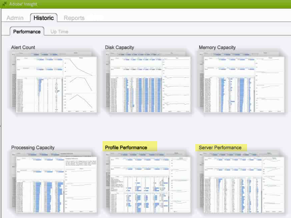

# Espace de travail de l’historique de Data Workbench{#data-workbench-historic-workspace}

{{eol}}

Utilisez le profil historique de Data Workbench pour voir comment la configuration, le matériel et d’autres modifications affectent les performances, la stabilité et la capacité du serveur au fil du temps.

Le profil historique comprend un profil [Performances du profil](../../../home/monitoring-installation/monitoring-profiles/monitoring-historical-using.md#section-184a86f9de054970bf68515bb9dea85d) jeu de données et serveur [Performances du serveur](../../../home/monitoring-installation/monitoring-profiles/monitoring-historical-using.md#section-5dad5870384b40e094d50173fcd90a09) jeu de données sous **[!UICONTROL Performance]** . Il s’agit des jeux de données les plus couramment utilisés, qui ont été consultés pour une ancienne perspective des performances du serveur Data Workbench. En outre, vous pouvez afficher la variable [Composants](../../../home/monitoring-installation/monitoring-profiles/monitoring-historical-using.md#section-5be7223abb384784bafe7b37c764ea66) et [Mode de traitement](../../../home/monitoring-installation/monitoring-profiles/monitoring-historical-using.md#section-5be7223abb384784bafe7b37c764ea66) en sélectionnant l’option **[!UICONTROL Up Time]** .

En outre, vous pouvez afficher la variable [Composants](../../../home/monitoring-installation/monitoring-profiles/monitoring-historical-using.md#section-5be7223abb384784bafe7b37c764ea66) et [Mode de traitement](../../../home/monitoring-installation/monitoring-profiles/monitoring-historical-using.md#section-5be7223abb384784bafe7b37c764ea66) en sélectionnant l’option **[!UICONTROL Up Time]** .

Pour obtenir des informations de référence supplémentaires sur les dimensions utilisées dans le profil historique de Data Workbench, voir [Dimensions du profil historique d’Insight.](../../../home/monitoring-installation/monitoring-appendix/monitoring-historical.md#concept-a42837c9c9274f83ad5bc5a6720f02b0)

## Espace de travail Performances des profils {#section-184a86f9de054970bf68515bb9dea85d}

Ce jeu de données comprend les mesures pertinentes suivantes pour la surveillance de Data Workbench.

* MégaBytes d’entrée rapide par minute : mesures affichant une entrée de données importante lors du traitement initial du journal.
* Fusion rapide : méga octets par minute : mesures affichant la transformation.

>[!NOTE]
>
>Pour effectuer une évaluation réelle des performances de votre profil, observez le taux plutôt que le temps calendaire écoulé. Le taux est mesuré comme les valeurs modifiées entre l’interrogation toutes les dix minutes.

## Espace de travail Performances du serveur {#section-5dad5870384b40e094d50173fcd90a09}

Ce jeu de données surveille les mesures du serveur au-delà de la portée des profils inclus et inclut les mesures de serveur appropriées suivantes pour la surveillance de Data Workbench.

* Minutes de balayage estimées — Temps de résolution de requête estimé.
* Latence du sondage Millisecondes — Indicateur de l’activité des logiciels en mesurant le temps nécessaire pour passer par un cycle complet de maintenance de chaque composant.

## Espace de travail des composants {#section-5be7223abb384784bafe7b37c764ea66}

Ce jeu de données se trouve sous l’onglet Heure de mise en service .

Le jeu de données Composants comprend deux aspects pour l’intégrité des composants :

* Mesure des communications : le processus du serveur Data Workbench a-t-il répondu ?
* Mesure Tous les composants : dans la partie supérieure de la page État détaillé se trouve une liste des composants dont l’hôte assure le service dans les processus du serveur Data Workbench. Si un composant est à l’état d’erreur, il est répertorié sous la table Composants en erreur .

## Espace de travail du mode de traitement {#section-3e1dedb9474e4b4ba513240943e76817}

Cet espace de travail se trouve sous l’onglet Heure de mise en service . Cet espace de travail vous permet d’observer le temps nécessaire à la saisie rapide, à la fusion rapide et en temps réel.

Ce jeu de données fournit des caractéristiques de chargement de serveur importantes, telles que l’identification de la charge de données pour

* Jour de la semaine (par exemple, un taux d’entrée rapide le mardi et le mercredi),
* Heure de la journée (quel pourcentage de la journée est-il en mode d’entrée rapide ?)
