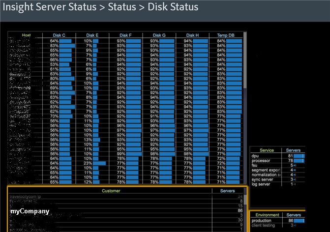

# Espace de travail Statut du serveur de Data Workbench{#data-workbench-server-status-workspace}

Le profil d’état du serveur de l’outil de données fournit des informations à jour sur l’état du serveur de l’outil de données en fonction du serveur plutôt que de mesures de profil ou de données historiques.

## État général {#section-65d1fa393cfd450cbacef3cba823fcc1}

Ouvrez la vue de jeux de données d’état général dans le profil d’état du serveur de l’outil de données.

Pour obtenir des informations de référence supplémentaires sur les dimensions utilisées dans le profil d’état du serveur de l’outil de données, consultez les [Dimensions du profil d’état du serveur Insight](../../../home/monitoring-installation/monitoring-appendix/monitoring-servers-profile.md#concept-8cbeb91e99bc42e2b52b22d551423f8a).

## État du disque {#section-36406f5f1262457e89ff13ad917f621f}

Vue de l&#39;utilisation actuelle du disque, y compris l&#39;utilisation interne de temp.db.

